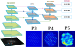
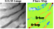
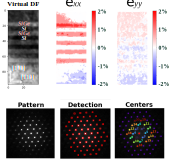

# Neural-Object-Detection-4D-STEM

Repository for automated analysis of 4D-STEM datasets using YOLOv8n. 
This workflow enables an end-to-end processing of large-scale 4D-STEM datasets for phase, orientation, and strain analysis

Phase mapping of complex phase-transformed Ti-50Nb alloy.

Strain mapping of Si/SiGe multilayers.

