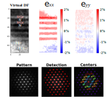

# Neural-Object-Detection-4D-STEM


This repository provides an automated pipeline for the analysis of 4D-STEM datasets using YOLOv8n.  
The workflow enables end-to-end processing of large-scale 4D-STEM datasets 
for phase identification, orientation mapping (coming soon!), and strain analysis.

---

### 🧬 Phase Mapping


Phase mapping of complex phase-transformed **Ti-50Nb** alloy using object detection-based pattern recognition.

---

### 🧪 Strain Mapping



Strain mapping of **Si/SiGe** multilayers demonstrating coherent lattice mismatch analysis.


**Supported file formats:**

- **Thermo Fisher Scientific**: `.emi`, `.xml` (EMPAD)  
- **GATAN**: `.dm3`, `.dm4`  
- **Direct Electron**: `.de5`  
- **Standard**: `.h5`, `.hdf5`


## 🛠️ Installation

> **Python ≥ 3.7 is required.**

We recommend creating a new virtual environment:

```bash
conda create -n tempo4d python=3.8
conda activate tempo4d
```
⚡ Install PyTorch (Recommended First)

If you have a CUDA-capable GPU, install a CUDA-compatible version of PyTorch before installing tempo4d.

👉 [Install PyTorch](https://pytorch.org/get-started/locally/)

📦 Install tempo4d
```
pip install tempo4d
```
This will install all required dependencies, including:

- **PyQt5**
- **pyqtgraph**
- **OpenCV**
- **matplotlib**
- **Ultralytics** (for YOLOv8)
- **rosettasciio[all]** (for TEM file support)


## Demo
Please also see the `tempo4d_demo.ipynb` notebook in the `demo` folder.


## Cite
```
@misc{genc2025neuralobjectdetection4d,
      title={Neural Object Detection for 4D STEM: High-Throughput Sub-Pixel Electron Diffraction Pattern Recognition}, 
      author={Arda Genc and Ravit Silverstein},
      year={2025},
      eprint={2506.04477},
      archivePrefix={arXiv},
      primaryClass={cond-mat.mtrl-sci},
      url={https://arxiv.org/abs/2506.04477}, 
}

```
